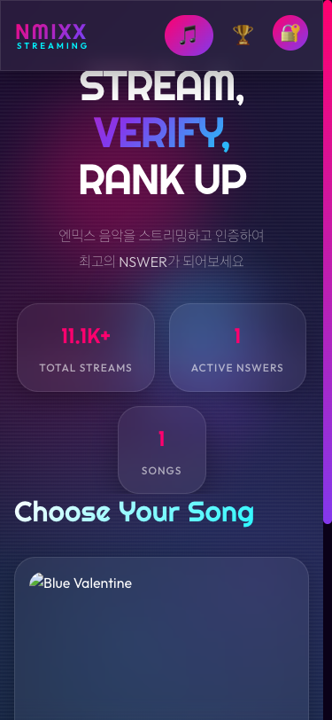
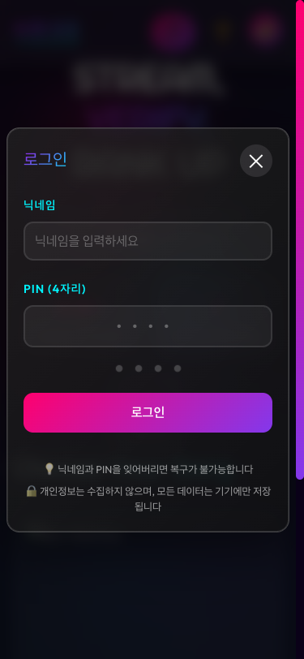
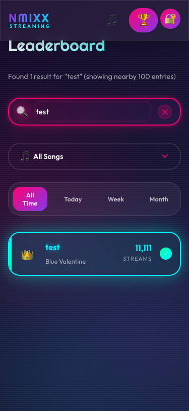
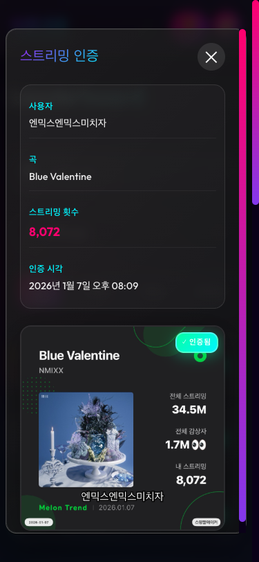

# 🎵 NMIXX Streaming Ranking

엔믹스 음악을 스트리밍하고 인증하여 최고의 NSWER가 되어보세요!

> **Built with Claude Sonnet 4.5**
> Claude Code의 `frontend-design` skill과 `playwright` skill을 활용하여 제작되었습니다.

---

## 📱 미리보기 (Mobile)

### 메인 화면
엔믹스 곡 목록과 전체 스트리밍 통계를 확인할 수 있습니다.

### 로그인
닉네임과 4자리 PIN으로 간편하게 로그인하세요.
개인정보는 수집하지 않으며, 모든 데이터는 기기에만 저장됩니다.

### 리더보드
실시간 순위를 확인하고 다른 NSWER들과 경쟁하세요!

### 닉네임 검색
리더보드에서 특정 사용자를 검색할 수 있습니다.

### 인증 확인
다른 사용자의 스트리밍 인증 스크린샷을 확인할 수 있습니다.

---

## 🚀 시작하기

### 1️⃣ 회원가입 (스트리밍 인증)

처음 사용하시는 분은 스트리밍 인증을 제출하면 자동으로 계정이 생성됩니다.

1. **메인 페이지**에서 원하는 엔믹스 곡을 선택하세요
2. **닉네임**을 입력하세요 (다른 사용자와 중복될 수 없습니다)
3. **4자리 PIN**을 설정하세요 (로그인 시 필요합니다)
4. **스트리밍 횟수**를 입력하세요
5. **스크린샷**을 업로드하세요 (멜론/스포티파이 등의 스트리밍 인증 화면)
6. **제출** 버튼을 클릭하세요

✅ 제출이 완료되면 자동으로 로그인됩니다!

⚠️ **주의사항:**
- 닉네임과 PIN은 반드시 기억해야 합니다 (복구 불가능)
- 개인정보는 수집하지 않습니다
- 로그인 정보는 기기에만 저장됩니다

---

### 2️⃣ 로그인

이미 계정이 있는 분은 간편하게 로그인할 수 있습니다.

1. 우측 상단의 **로그인 버튼 (🔐)** 을 클릭하세요
2. **닉네임**과 **PIN**을 입력하세요
3. **로그인** 버튼을 클릭하세요

✅ 로그인하면 리더보드에서 내 순위가 강조 표시됩니다!

---

### 3️⃣ 리더보드 확인

상단의 **리더보드 버튼 (🏆)** 을 클릭하면 순위를 확인할 수 있습니다.

#### 필터 옵션
- **All Time**: 전체 기간 순위
- **Today**: 오늘 제출된 인증만
- **Week**: 이번 주 제출된 인증만
- **Month**: 이번 달 제출된 인증만

#### 곡 필터
- **All Songs**: 모든 곡의 순위
- **특정 곡 선택**: 선택한 곡만 필터링

#### 내 순위 확인
- 로그인 후 특정 곡을 선택하면 상단에 **내 순위 카드**가 표시됩니다
- 리더보드에서 내 항목이 **강조 표시**됩니다

#### 닉네임 검색
- 검색창에 닉네임을 입력하면 해당 사용자를 찾을 수 있습니다
- 검색 결과는 **청록색으로 강조**됩니다
- 매칭된 사용자가 맨 위에 표시되고, 그 아래로 99명이 나타납니다

---

### 4️⃣ 인증 확인

리더보드에서 임의의 항목을 클릭하면 해당 사용자의 **스트리밍 인증 스크린샷**을 확인할 수 있습니다.

- 사용자 정보 (닉네임, 곡, 스트리밍 횟수)
- 인증 시각
- 인증 스크린샷

---

## ✨ 주요 기능

- 🎵 **엔믹스 곡별 스트리밍 인증**
- 🏆 **실시간 리더보드** (전체/오늘/이번주/이번달)
- 🔍 **닉네임 검색** (상위 100개 중 검색)
- 👤 **내 순위 강조 표시**
- 🔐 **간편 로그인** (닉네임 + 4자리 PIN)
- 📸 **인증 스크린샷 확인**
- 🎨 **홀로그래픽 Y2K 디자인**
- 📱 **완벽한 반응형 디자인** (모바일/태블릿/데스크톱)

---

## 🎨 디자인 특징

이 프로젝트는 **Claude Sonnet 4.5**와 **frontend-design skill**을 사용하여 제작되었습니다.

- **홀로그래픽 Y2K 스타일**: NMIXX의 컨셉에 맞는 미래지향적 디자인
- **글래스모피즘**: 반투명 효과와 배경 흐림 처리
- **부드러운 애니메이션**: Framer Motion을 활용한 자연스러운 전환
- **그라데이션 효果**: 핑크, 퍼플, 시안 컬러의 조화
- **반응형 디자인**: 모든 디바이스에서 완벽한 경험

---

## 🛠️ 기술 스택

### Frontend
- React + TypeScript
- Vite (빌드 도구)
- Framer Motion (애니메이션)
- Axios (API 통신)
- React Dropzone (파일 업로드)

### Backend
- Flask (Python)
- PostgreSQL (데이터베이스)
- SQLAlchemy (ORM)

### Deployment
- Docker + Docker Compose
- Nginx (리버스 프록시)
- Let's Encrypt (SSL 인증서)

---

## 🤖 AI 정보

이 프로젝트는 **Claude Sonnet 4.5** (model ID: `claude-sonnet-4-5-20250929`)를 사용하여 개발되었습니다.

### 사용된 Claude Code Skills
- **`frontend-design`**: 홀로그래픽 Y2K 디자인의 프론트엔드 구현
- **`playwright`**: 모바일 스크린샷 캡처 및 테스트

### 주요 AI 기능
- 🎨 독창적인 UI/UX 디자인
- 💻 Full-stack 개발 (React + Flask)
- 🔒 보안 (PIN 해싱, SQL injection 방지)
- 📱 반응형 디자인 최적화
- 🎭 애니메이션 및 인터랙션 구현

---

## 📞 문의 및 지원

문제가 발생하거나 건의사항이 있으시면 GitHub Issues에 등록해주세요.

---

## 💜 Made with Love

Made with 💜 for **NMIXX** & **NSWER**

Powered by **Claude Sonnet 4.5** 🤖
